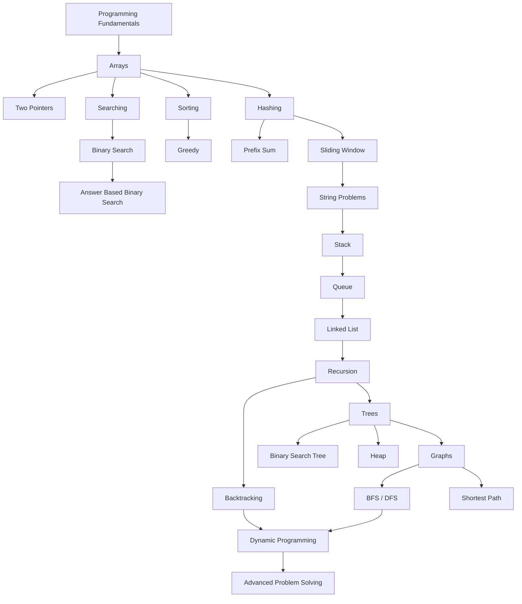
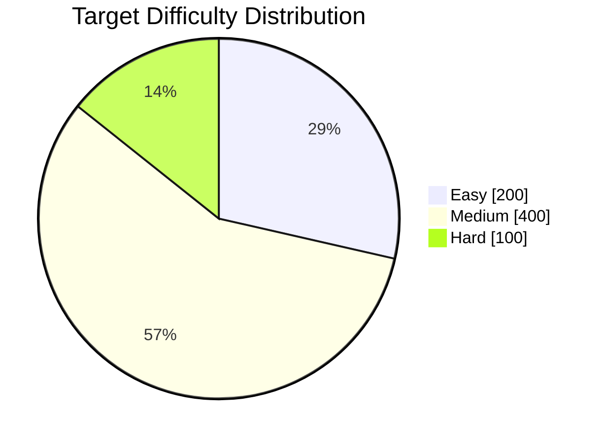

<div align="center">


<a href="https://git.io/typing-svg">
  
</a>

<br />

### 🚀 A growing collection of my Data Structures and Algorithms solutions

<p>
  This repository is my personal DSA training ground where I solve problems, write clean C++ solutions,
  record approaches, analyze complexity, and track my journey toward solving <strong>700+ LeetCode problems</strong>.
</p>

<br />

<a href="#-solved-problems-dashboard">
  
</a>
<a href="#-topic-wise-practice-map">
  
</a>
<a href="#-how-to-run-a-solution">
  
</a>

<br />
<br />


<br />


</div>

---

# 🧠 About This Repository

This repository contains my **Data Structures and Algorithms practice solutions**, mainly written in **C++**.

The goal of this repository is not only to store accepted solutions.

The real goal is to build strong problem-solving ability by understanding:

* how to identify the correct pattern;
* how to write clean C++ code;
* how to improve brute force solutions;
* how to analyze time and space complexity;
* how to revise solved problems later;
* how to track long-term coding consistency.

<div align="center">

```text
Learn Pattern  →  Solve Problem  →  Optimize Code  →  Write Complexity  →  Revise Again
```

</div>

---

# 🎯 Main Goal

<div align="center">

## 🔥 700+ LeetCode Problems Mission

| Target              | Status                                                         |
| :------------------ | :------------------------------------------------------------- |
| **Total Goal**      | `700+ Problems`                                                |
| **Language**        | `C++`                                                          |
| **Current Focus**   | `Arrays, Two Pointers, Binary Search, Strings, Sorting`        |
| **Long-Term Focus** | `DP, Trees, Graphs, Backtracking, Advanced DSA`                |
| **Purpose**         | `Strong DSA + Placement Preparation + Problem Solving Mindset` |

</div>

> This repository will keep growing as I solve more problems and improve my understanding of DSA.

---

# 📌 Why I Am Building This

I am using this repository to create a visible record of my DSA journey.

Every solved problem helps me improve in one or more areas:

<table>
<tr>
<td width="50%" valign="top">

### 🧩 Pattern Recognition

Understanding whether a problem needs:

* Two pointers
* Binary search
* Hashing
* Prefix sum
* Sliding window
* Recursion
* Dynamic programming
* Graph traversal

</td>
<td width="50%" valign="top">

### ⚙️ Code Optimization

Learning how to move from:

```text
Brute Force → Better Approach → Optimal Solution
```

</td>
</tr>

<tr>
<td width="50%" valign="top">

### 🧠 Logical Thinking

Improving the ability to break a problem into smaller steps and convert the idea into code.

</td>
<td width="50%" valign="top">

### 📈 Consistency

Building a long-term habit of solving problems regularly instead of learning only theory.

</td>
</tr>
</table>

---

# 📊 Solved Problems Dashboard

<div align="center">

## Current Progress

| Category                    |                     Count |
| :-------------------------- | ------------------------: |
| **Current Solved Problems** |                     `43+` |
| **Final Target**            |                    `700+` |
| **Main Language**           |                     `C++` |
| **Repository Type**         | `LeetCode + DSA Practice` |

<br />

### Progress Toward 700 Problems

```text
43 / 700 Problems Solved

[██░░░░░░░░░░░░░░░░░░░░░░░░░░░░] 6.1%
```

<br />

> The number will keep increasing as I solve more problems.

</div>

---

# 🧭 Topic-Wise Practice Map

<div align="center">

| Topic                     |    Status    | Focus                                                              |
| :------------------------ | :----------: | ------------------------------------------------------------------ |
| **Array**                 |   ✅ Started  | Basic operations, searching, sorting, two pointers                 |
| **Two Pointers**          |   ✅ Started  | Sorted arrays, pair problems, string problems                      |
| **Binary Search**         |   ✅ Started  | Search space reduction, rotated arrays, answer-based binary search |
| **String**                |   ✅ Started  | Palindrome, character processing, simple string logic              |
| **Sorting**               |   ✅ Started  | Sorting-based logic, greedy support, counting                      |
| **Hash Table**            |   ✅ Started  | Frequency, lookup, duplicates                                      |
| **Prefix Sum**            |   ✅ Started  | Range logic, split array style problems                            |
| **Greedy**                |   ✅ Started  | Local optimal choices                                              |
| **Math**                  |   ✅ Started  | Number logic, digit manipulation                                   |
| **Dynamic Programming**   | 🚧 Beginning | Optimization and overlapping subproblems                           |
| **Stack**                 |  🔜 Upcoming | Monotonic stack, expression problems                               |
| **Queue**                 |  🔜 Upcoming | BFS foundation and simulation                                      |
| **Linked List**           |  🔜 Upcoming | Pointer movement and list operations                               |
| **Tree**                  |  🔜 Upcoming | Traversals, recursion, BST                                         |
| **Graph**                 |  🔜 Upcoming | BFS, DFS, shortest path                                            |
| **Backtracking**          |  🔜 Upcoming | Choices, recursion tree, combinations                              |
| **Heap / Priority Queue** |  🔜 Upcoming | Top K, scheduling, optimization                                    |

</div>

---

# 🧱 DSA Roadmap I Am Following



---

# 🗂️ Repository Structure

```text
DSA_Practics/
│
├── array/
│   └── 001_two_sum.c++
│
└── searching/
    └── bineary_search/
        ├── first_and_last_number_of_givin_target.cpp
        └── search_one_target.cpp
```

> Some folder names may preserve the names used when I first created them.
> As this repository grows, I will keep improving the structure and naming.

---

# 🧾 Solution Format

Each solution is written with the goal of being useful for revision.

A good solution should contain:

```text
1. Problem name
2. Problem link
3. Input and output explanation
4. Brute force idea, if useful
5. Optimized approach
6. Step-by-step logic
7. Clean C++ code
8. Time complexity
9. Space complexity
10. Example test case
```

---

# 🧪 Example Solution Style

```cpp
/*
Problem: Search Insert Position
Topic: Binary Search
Difficulty: Easy

Approach:
- Use binary search to find the target.
- If target exists, return its index.
- If target does not exist, return the position where it should be inserted.

Time Complexity: O(log n)
Space Complexity: O(1)
*/

class Solution {
public:
    int searchInsert(vector<int>& nums, int target) {
        int low = 0;
        int high = nums.size() - 1;

        while (low <= high) {
            int mid = low + (high - low) / 2;

            if (nums[mid] == target) {
                return mid;
            }
            else if (nums[mid] < target) {
                low = mid + 1;
            }
            else {
                high = mid - 1;
            }
        }

        return low;
    }
};
```

---

# ⚡ How To Run A Solution

## Using G++

Compile any solution file using a C++17-compatible compiler.

Example:

```bash
g++ "DSA_Practics/array/001_two_sum.c++" -std=c++17 -o two_sum
```

Run on Linux or macOS:

```bash
./two_sum
```

Run on Windows PowerShell:

```powershell
.\two_sum.exe
```

---

# 🧠 My Problem-Solving Process

Whenever I solve a problem, I try to follow this process:

```text
Step 1: Understand the problem clearly
Step 2: Identify inputs, outputs, and constraints
Step 3: Try a brute force approach
Step 4: Find the pattern
Step 5: Optimize the solution
Step 6: Write clean code
Step 7: Test with examples and edge cases
Step 8: Write time and space complexity
Step 9: Revise the problem later
```

---

# 🔍 Common Patterns I Am Practicing

<details>
<summary><b>📌 Array Patterns</b></summary>

<br />

* Linear traversal
* In-place modification
* Sorting-based solutions
* Frequency counting
* Prefix sum
* Kadane-style thinking
* Two pointers on arrays
* Searching in sorted arrays

</details>

<details>
<summary><b>📌 Two Pointers Patterns</b></summary>

<br />

* Left and right pointer
* Slow and fast pointer
* Sorted array pair search
* Removing duplicates
* Reversing
* Palindrome checking
* Merging arrays

</details>

<details>
<summary><b>📌 Binary Search Patterns</b></summary>

<br />

* Normal binary search
* Lower bound
* Upper bound
* Search insert position
* Search in rotated sorted array
* Find minimum in rotated sorted array
* First and last occurrence
* Binary search on answer

</details>

<details>
<summary><b>📌 String Patterns</b></summary>

<br />

* Character traversal
* Reverse string
* Palindrome check
* Word counting
* Two pointers on strings
* String merging

</details>

<details>
<summary><b>📌 Hashing Patterns</b></summary>

<br />

* Frequency count
* Duplicate detection
* Fast lookup
* Counting occurrences
* Hash map based optimization

</details>

<details>
<summary><b>📌 Dynamic Programming Patterns</b></summary>

<br />

* Recursion to DP
* Memoization
* Tabulation
* One-dimensional DP
* Two-dimensional DP
* Pick / not pick
* Subsequence problems
* Partition problems

</details>

---

# 🧩 Milestone Plan

<div align="center">

|   Milestone   |          Target | Meaning                              |
| :-----------: | --------------: | ------------------------------------ |
|   🟢 Level 1  |   `50 Problems` | Build basic consistency              |
|   🔵 Level 2  |  `100 Problems` | Strong beginner foundation           |
|   🟣 Level 3  |  `200 Problems` | Pattern recognition starts improving |
|   🟠 Level 4  |  `350 Problems` | Medium-level confidence              |
|   🔴 Level 5  |  `500 Problems` | Serious interview preparation        |
| 🏆 Final Goal | `700+ Problems` | Strong DSA portfolio                 |

</div>

---

# 📚 Solved Problems

| No. | Problem                                                                                                                   | Topic         | Approach                | Time       | Space  |
| --: | ------------------------------------------------------------------------------------------------------------------------- | ------------- | ----------------------- | ---------- | ------ |
|   1 | [Two Sum](DSA_Practics/array/001_two_sum.c++)                                                                             | Array         | Two pointers            | `O(n)`     | `O(1)` |
|   2 | [Search for One Target](DSA_Practics/searching/bineary_search/search_one_target.cpp)                                      | Binary Search | Iterative binary search | `O(log n)` | `O(1)` |
|   3 | [Find First and Last Position of Target](DSA_Practics/searching/bineary_search/first_and_last_number_of_givin_target.cpp) | Binary Search | Two binary searches     | `O(log n)` | `O(1)` |

> **Note:** The Two Sum solution uses two pointers, so its input array must be sorted in ascending order.

---

# 🏆 Difficulty Tracker

<div align="center">

| Difficulty |   Goal |              Status |
| :--------: | -----: | ------------------: |
|   🟢 Easy  | `200+` | Building foundation |
|  🟡 Medium | `400+` |    Main growth zone |
|   🔴 Hard  | `100+` |  Advanced challenge |

</div>



---

# 📈 GitHub Activity

<div align="center">


<br />


<br />


</div>

---

# 📝 Revision Strategy

Solving once is not enough.

I plan to revise important problems multiple times:

```text
First Solve   → Understand the pattern
Second Solve  → Improve speed
Third Solve   → Write cleaner code
Fourth Solve  → Solve without looking
```

## Revision Tags I May Use Later

|      Tag     | Meaning                       |
| :----------: | ----------------------------- |
| `REVISION-1` | Solved once, needs revision   |
|  `IMPORTANT` | Must revise before interviews |
|   `PATTERN`  | Good pattern-based problem    |
|   `TRICKY`   | Easy-looking but confusing    |
|    `HARD`    | Needs deeper understanding    |

---

# 🚧 Future Improvements

* [ ] Add problem-wise notes
* [ ] Add topic-wise README files
* [ ] Add brute force and optimized approaches
* [ ] Add revision tags
* [ ] Add difficulty count badges
* [ ] Add more C++ STL explanations
* [ ] Add pattern-based folders
* [ ] Add 100-problem milestone summary
* [ ] Add 300-problem milestone summary
* [ ] Add 700-problem final roadmap
* [ ] Improve folder naming and structure
* [ ] Add personal notes for hard problems

---

# 💡 Lessons I Am Learning

This repository is helping me understand that DSA is not about memorizing answers.

It is about learning how to think.

Every problem teaches something:

* how to reduce unnecessary work;
* how to use the correct data structure;
* how to convert logic into code;
* how to handle edge cases;
* how to write optimized solutions;
* how to stay consistent even when problems feel difficult.

---

# 🤝 Connect With Me

<div align="center">

## Munna Kumar

### B.Tech CSE Student • C++ Learner • DSA Practitioner • Future Software Developer

<br />

<a href="https://github.com/munnnakumargpj4321-prog">
  
</a>

<a href="https://leetcode.com/">
  
</a>

</div>

---

# ⭐ Support

<div align="center">

If this repository inspires you to start your own DSA journey, you can support it by giving a star.

<br />

<a href="https://github.com/munnnakumargpj4321-prog/dsa-practice">
  
</a>

<a href="https://github.com/munnnakumargpj4321-prog/dsa-practice/stargazers">
  
</a>

</div>

---

<div align="center">

## 🚀 One problem at a time. One pattern at a time. One level higher every day.


</div>

---

<!-- 
IMPORTANT:
Keep the LeetCode Topics section below this comment.
If you use a LeetCode auto-sync tool, it may update the section between:
LeetCode Topics Start
and
LeetCode Topics End
-->

<!---LeetCode Topics Start-->
# LeetCode Topics
## String
| Problem Name | Difficulty |
| ------- | ------- |
| [1108-defanging-an-ip-address](https://github.com/munnnakumargpj4321-prog/dsa-practice/tree/main/1108-defanging-an-ip-address/) | Easy |
| [1221-split-a-string-in-balanced-strings](https://github.com/munnnakumargpj4321-prog/dsa-practice/tree/main/1221-split-a-string-in-balanced-strings/) | Easy |
| [1528-shuffle-string](https://github.com/munnnakumargpj4321-prog/dsa-practice/tree/main/1528-shuffle-string/) | Easy |
| [1662-check-if-two-string-arrays-are-equivalent](https://github.com/munnnakumargpj4321-prog/dsa-practice/tree/main/1662-check-if-two-string-arrays-are-equivalent/) | Easy |
| [1678-goal-parser-interpretation](https://github.com/munnnakumargpj4321-prog/dsa-practice/tree/main/1678-goal-parser-interpretation/) | Easy |
| [1816-truncate-sentence](https://github.com/munnnakumargpj4321-prog/dsa-practice/tree/main/1816-truncate-sentence/) | Easy |
| [1910-remove-all-occurrences-of-a-substring](https://github.com/munnnakumargpj4321-prog/dsa-practice/tree/main/1910-remove-all-occurrences-of-a-substring/) | Medium |
| [3110-score-of-a-string](https://github.com/munnnakumargpj4321-prog/dsa-practice/tree/main/3110-score-of-a-string/) | Easy |
## Array
| Problem Name | Difficulty |
| ------- | ------- |
| [0209-minimum-size-subarray-sum](https://github.com/munnnakumargpj4321-prog/dsa-practice/tree/main/0209-minimum-size-subarray-sum/) | Medium |
| [1051-height-checker](https://github.com/munnnakumargpj4321-prog/dsa-practice/tree/main/1051-height-checker/) | Easy |
| [1528-shuffle-string](https://github.com/munnnakumargpj4321-prog/dsa-practice/tree/main/1528-shuffle-string/) | Easy |
| [1608-special-array-with-x-elements-greater-than-or-equal-x](https://github.com/munnnakumargpj4321-prog/dsa-practice/tree/main/1608-special-array-with-x-elements-greater-than-or-equal-x/) | Easy |
| [1662-check-if-two-string-arrays-are-equivalent](https://github.com/munnnakumargpj4321-prog/dsa-practice/tree/main/1662-check-if-two-string-arrays-are-equivalent/) | Easy |
| [1816-truncate-sentence](https://github.com/munnnakumargpj4321-prog/dsa-practice/tree/main/1816-truncate-sentence/) | Easy |
| [2529-maximum-count-of-positive-integer-and-negative-integer](https://github.com/munnnakumargpj4321-prog/dsa-practice/tree/main/2529-maximum-count-of-positive-integer-and-negative-integer/) | Easy |
## Sorting
| Problem Name | Difficulty |
| ------- | ------- |
| [1051-height-checker](https://github.com/munnnakumargpj4321-prog/dsa-practice/tree/main/1051-height-checker/) | Easy |
| [1608-special-array-with-x-elements-greater-than-or-equal-x](https://github.com/munnnakumargpj4321-prog/dsa-practice/tree/main/1608-special-array-with-x-elements-greater-than-or-equal-x/) | Easy |
## Counting Sort
| Problem Name | Difficulty |
| ------- | ------- |
| [1051-height-checker](https://github.com/munnnakumargpj4321-prog/dsa-practice/tree/main/1051-height-checker/) | Easy |
| [1221-split-a-string-in-balanced-strings](https://github.com/munnnakumargpj4321-prog/dsa-practice/tree/main/1221-split-a-string-in-balanced-strings/) | Easy |
| [2529-maximum-count-of-positive-integer-and-negative-integer](https://github.com/munnnakumargpj4321-prog/dsa-practice/tree/main/2529-maximum-count-of-positive-integer-and-negative-integer/) | Easy |
## Binary Search
| Problem Name | Difficulty |
| ------- | ------- |
| [0209-minimum-size-subarray-sum](https://github.com/munnnakumargpj4321-prog/dsa-practice/tree/main/0209-minimum-size-subarray-sum/) | Medium |
| [1608-special-array-with-x-elements-greater-than-or-equal-x](https://github.com/munnnakumargpj4321-prog/dsa-practice/tree/main/1608-special-array-with-x-elements-greater-than-or-equal-x/) | Easy |
| [2529-maximum-count-of-positive-integer-and-negative-integer](https://github.com/munnnakumargpj4321-prog/dsa-practice/tree/main/2529-maximum-count-of-positive-integer-and-negative-integer/) | Easy |
## Sliding Window
| Problem Name | Difficulty |
| ------- | ------- |
| [0209-minimum-size-subarray-sum](https://github.com/munnnakumargpj4321-prog/dsa-practice/tree/main/0209-minimum-size-subarray-sum/) | Medium |
## Prefix Sum
| Problem Name | Difficulty |
| ------- | ------- |
| [0209-minimum-size-subarray-sum](https://github.com/munnnakumargpj4321-prog/dsa-practice/tree/main/0209-minimum-size-subarray-sum/) | Medium |
## Stack
| Problem Name | Difficulty |
| ------- | ------- |
| [1910-remove-all-occurrences-of-a-substring](https://github.com/munnnakumargpj4321-prog/dsa-practice/tree/main/1910-remove-all-occurrences-of-a-substring/) | Medium |
## Simulation
| Problem Name | Difficulty |
| ------- | ------- |
| [1910-remove-all-occurrences-of-a-substring](https://github.com/munnnakumargpj4321-prog/dsa-practice/tree/main/1910-remove-all-occurrences-of-a-substring/) | Medium |
## Greedy
| Problem Name | Difficulty |
| ------- | ------- |
| [1221-split-a-string-in-balanced-strings](https://github.com/munnnakumargpj4321-prog/dsa-practice/tree/main/1221-split-a-string-in-balanced-strings/) | Easy |
<!---LeetCode Topics End-->
ics End-->
